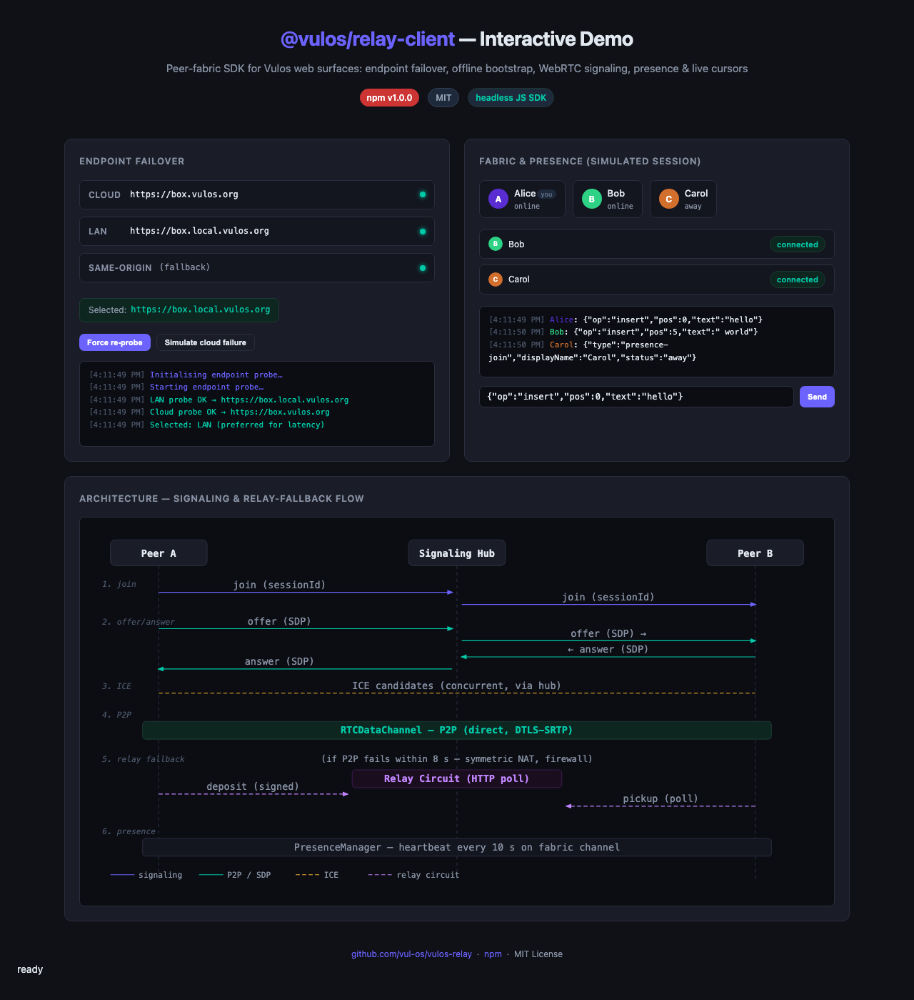
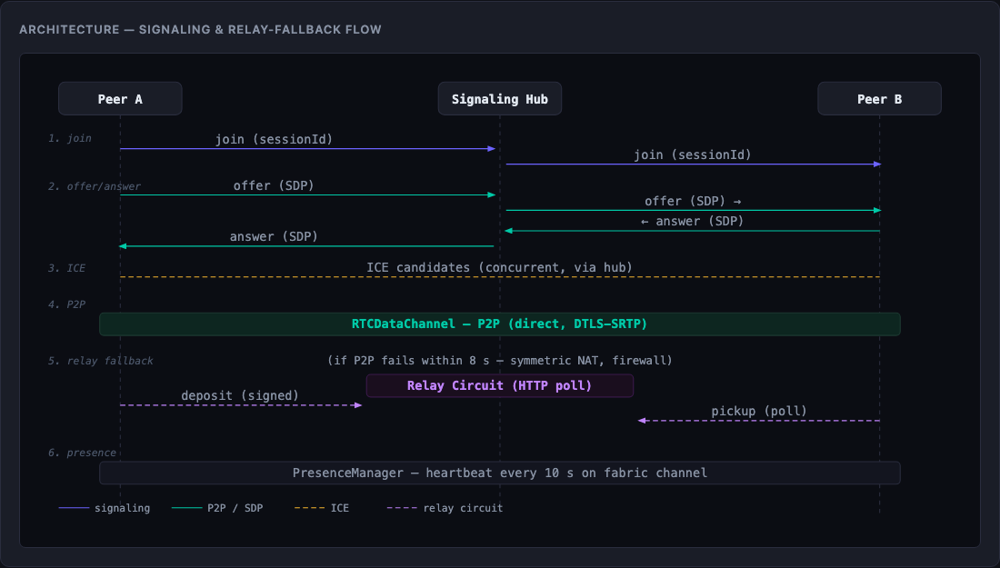
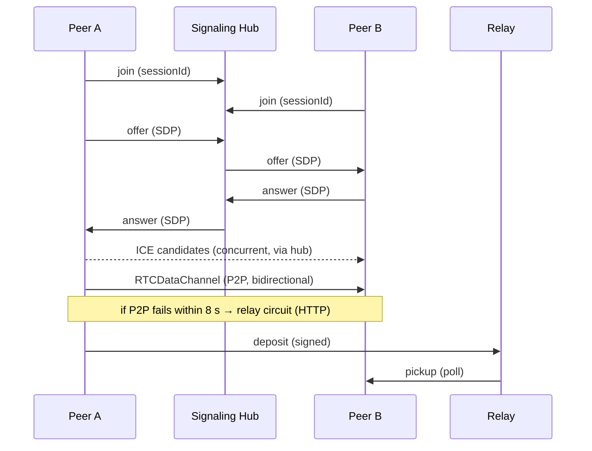

<div align="center">


# Vulos Relay

**The sovereign connectivity fabric — `@vulos/relay-client` peer-fabric SDK + a self-hosted Go reverse-tunnel**

[](https://www.npmjs.com/package/@vulos/relay-client)
[](LICENSE)
[](https://github.com/vul-os/vulos-relay/actions/workflows/ci.yml)

*Vulos — rooted in **vula**, the Zulu and Xhosa word for **open**.*

</div>

---

## What is Vulos Relay?

Vulos Relay is a **sovereign connectivity fabric** — the **single reachability
primitive** for reaching sovereign, self-hosted boxes across the network boundary.
Its doctrine is **direct-first, relay-fallback**:
a box is reached over its own public endpoint whenever it has one (near-native
latency), and over the always-works relay tunnel otherwise (NAT/CGNAT). Relay carries
**web-shaped traffic** — HTTP, WebSocket, and SSE — the request/response and
event-stream shape web surfaces speak. It is deliberately *not* the transport
for the two workloads that have their own better path: **real-time media** rides
WebRTC over **ICE/TURN** directly (mesh, or a self-hosted SFU/TURN node the box
reaches over its verified direct endpoint — Relay never forwards RTP), and **mail**
rides the dedicated HTTP **spool → forward** edge. Relay ships **two complementary
deliverables**:

- **`@vulos/relay-client`** (JS/TS SDK) — wires browser peers together with
  **WebRTC peer-to-peer data channels**, multiplexing signaling, presence, and
  live cursors, and **falling back to a relay circuit** when a direct connection
  can't be established. It's a **client only** — it talks to its host app's
  `/api/peering/*` endpoints for signaling and ICE credentials; TLS is always
  terminated at the edge, so the SDK only ever speaks `https`/`wss`. This powers
  **P2P collaboration** (incl. E2E-encrypted, room-gated document co-editing).

- **A self-hosted Go reverse-tunnel** (`tunnel/` + `cmd/vulos-relayd` +
  `cmd/vulos-relay-agent`) — the **sovereign replacement for `frp` / ngrok /
  Cloudflare Tunnel**. A loopback-bound box dials one outbound `wss://`
  connection to a relay **you control**, which serves a public URL and
  reverse-proxies HTTP + WebSocket back down it — **no inbound ports, no static
  IP, no third-party relay**. The agent can **link to a Vulos account** so its
  usage is metered through Vulos Cloud billing, or run **unlinked and unbilled**
  for pure self-host. This powers **public exposure + cross-instance federation**.

> **Not** the OS app-gateway. Routing `/app/<id>` to a box's local app ports
> (with auth-token injection) is the VulOS shell's own internal reverse proxy —
> a separate concern that stays in the OS. Relay is for crossing the *network*
> boundary (P2P + public exposure), not the in-box one.

---

## Deployment modes

Relay is connectivity **infrastructure**, so its deployment shape is about *who
runs the relay server*, not a per-app `DEPLOY_MODE`:

| Shape | Who runs the relay server | Billing |
|---|---|---|
| **Self-hosted relay** (sovereign) | You run `vulos-relayd` on a host you control; agents authorize with static grants | Unlinked, **unbilled** — no Vulos account needed |
| **Managed pool** (opt-in) | A hosted **multi-region, smart-autoscaled pool** of PoPs runs it; you run only the agent, which dials its **CP-assigned nearest/least-loaded PoP** | Metered per-GB (region-stamped) against your account tier |

The **managed pool** is a geo-distributed set of
relay PoPs that a **CP-driven autoscaler**
grows, shrinks, and **gracefully drains** as load moves, so a PoP scale-down migrates
every live tunnel with **zero dropped connectivity**. The **exact same binary** is
fully **self-hostable and CP-optional**: run `vulos-relayd` with no CP link and it is
a sovereign single relay that meters nothing and needs no account. The CP↔relay
autoscaler contract (PoP registration + load heartbeat, PoP assignment, graceful
drain, proactive reconnect) is documented in
[docs/TUNNEL.md](docs/TUNNEL.md#smart-autoscaler--the-cprelay-contract).

The box-side **agent** (`vulos-relay-agent`) is the *same binary* in both — the
only difference is whether its grant carries an `account_id` (opt-in linking).
The **SDK** (`@vulos/relay-client`) has no deployment shape of its own: it is a
client library that talks to whichever peering backend hosts it (a self-hosted
box, an OS-managed box, or the cloud). Full walkthroughs — Path A (self-hosted)
vs Path B (Vulos-hosted) — are in [GETTING-STARTED.md](docs/GETTING-STARTED.md).

---

## Features

- **P2P fabric sessions** — `FabricClient` opens one `RTCDataChannel`
  (DTLS-SRTP) per remote peer for a given session/document id, with
  polite-peer SDP negotiation (the lexicographically smaller `peerId` defers).
- **Relay fallback** — when a data channel can't be established within 8 s (or a
  live connection fails), the SDK transparently switches that peer to a **relay
  circuit**: messages are deposited and picked up over the host's
  `deposit` / `pickup` / `ack` HTTP API.
- **E2E peer authentication** — each peer mints a per-session **ECDSA P-256**
  key on join, publishes the raw public key in its signaling `join` frame, and
  signs every outgoing `offer`/`answer`/`ice` frame and every relay deposit
  (`to` + `from` + `nonce` + `blob`). The receiving client verifies signatures
  and enforces a signed-timestamp / nonce replay cache before processing any
  frame (`requirePeerAuth: true` by default). The `sdp` field is included in
  the signed material for client-side DTLS fingerprint pinning.
- **Endpoint failover** — `selectEndpoint()` health-probes a cloud and a LAN
  base URL concurrently, prefers LAN-direct for latency, falls back to cloud,
  then same-origin. A 400 ms debounce coalesces Wi-Fi-handoff bursts; failures
  force an immediate re-probe; selections are cached in `localStorage` so
  failover keeps working with the discovery cloud down.
- **Signaling reconnect** — `SignalingClient` rides the host's
  `/api/peering/stream` WebSocket with exponential back-off (1 s → 30 s) and a
  terminal `offline` event after a 10-attempt budget so the UI can show a
  degraded-mode banner. It keeps retrying at max delay, so it self-heals when
  the network returns.
- **Presence** — `PresenceManager` (+ `usePresence` React hook) broadcasts
  multi-peer awareness on a dedicated channel: 10 s heartbeat, 25 s GC, status
  values (`online` / `away` / `dnd` / `in-a-call`), and auto-generated,
  persisted guest identities.
- **Live cursors** — `useLiveCursors` React hook multiplexes carets and
  selections (Docs / Sheets / Slides) on the fabric channel with 80 ms
  pointer-event throttling and token-aware peer colours.
- **P2P mesh calls** — `createCall` for audio/video mesh sessions (the LiveKit
  SFU path was removed before 1.0; the product uses the P2P mesh exclusively).
- **Tree-shakeable subpaths** — import only what you need
  (`@vulos/relay-client/endpoints`, `/fabric`, `/presence`, …); the `xlsx`-using
  `roundTripCheck` is deliberately kept out of the root barrel.
- **Dual build** — ESM (`.js`) + CJS (`.cjs`) bundles with generated `.d.ts`
  types; `react` and `xlsx` are optional peer dependencies.

---

## Demo

Relay is a headless SDK, so there is **no app UI to screenshot**. Instead, the
repo ships a self-contained **interactive demo** (`demo/index.html`) that drives
the real SDK in the browser with in-process stub peers — no backend or
credentials required. The screenshotter renders it to PNGs:

| | |
|---|---|
|  |  |
| Endpoint failover + fabric/presence panels | Signaling & relay-fallback sequence |

Regenerate with `npm run screenshots` (Playwright). See
[docs/SCREENSHOTS.md](docs/SCREENSHOTS.md).

---

## Quick start (standalone)

`@vulos/relay-client` is a plain npm package — install it on its own, point it
at any backend that implements the peering contract, and use it without the rest
of VulOS.

```bash
npm install @vulos/relay-client
```

`react` and `xlsx` are **optional** peer dependencies — install them only if you
use the React hooks (`usePresence`, `useLiveCursors`) or the `roundTripCheck`
subpath.

A minimal fabric session with presence. All exports below are verified against
`client/src` — `FabricClient` and `PresenceManager` extend `EventTarget`, so you
subscribe with `addEventListener`.

```js
import { selectEndpoint }  from '@vulos/relay-client/endpoints'
import { FabricClient }    from '@vulos/relay-client/fabric'
import { PresenceManager } from '@vulos/relay-client/presence'

// 1. Pick the best reachable backend (LAN-direct → cloud → same-origin).
const base = await selectEndpoint()

// 2. Open a fabric session for a document/room id.
const fabric = new FabricClient({
  sessionId:    'doc-abc123',
  peerId:       currentUser.id,
  signalingUrl: `${base.replace(/^http/, 'ws')}/api/peering/stream`,
  iceUrl:       `${base}/api/peering/ice`,   // optional; this is the default path
  authToken:    session.jwt,                 // optional Bearer JWT
})

// 3. Receive application messages (e.g. CRDT ops) from peers.
fabric.addEventListener('message', ({ detail: { from, data } }) => {
  console.log('message from', from, data)
})

// 4. Track per-peer connection state: connecting | connected | relay | disconnected
fabric.addEventListener('state', ({ detail: { peerId, state } }) => {
  console.log(peerId, '→', state)
})

await fabric.join()
fabric.send(JSON.stringify({ op: 'insert', pos: 0, text: 'hello' })) // broadcast
// fabric.sendTo(peerId, payload)  // unicast to one peer

// 5. Layer presence on top of the fabric.
const presence = new PresenceManager({
  fabric,
  localIdentity: { accountId: currentUser.id, displayName: currentUser.name },
})
presence.addEventListener('roster', ({ detail: roster }) => console.log(roster))
presence.join()
```

In React, prefer the hooks:

```jsx
import { usePresence }    from '@vulos/relay-client/presence'
import { useLiveCursors } from '@vulos/relay-client/useLiveCursors'

const { roster, manager } = usePresence({ fabric, localIdentity })
const { remoteCursors, broadcastDocCursor } =
  useLiveCursors({ fabric, localIdentity, color })
```

Inside the VulOS monorepo, consumers use a `file:` dependency instead of the
published package:

```jsonc
// package.json
"@vulos/relay-client": "file:../vulos-relay/client"
```

To explore the SDK with **zero setup**, build the client and open the
interactive demo (it imports the built bundle directly — no backend needed):

```bash
cd client && npm ci && npm run build   # produces client/dist-lib/
npm run screenshots                    # or just open demo/index.html in a browser
```

> The endpoint layer also exposes `configure({ lsKeyPrefix, healthPath })` so a
> surface can preserve its existing `localStorage` cache and point the health
> probe at its own auth endpoint. See [`client/README.md`](client/README.md) for
> the full subpath map.

---

## Architecture

A fabric session moves through six phases:

1. **Join** — fetch ICE/TURN servers (`/api/peering/ice`, falling back to the
   cloud `/api/turn/credentials`) and open the signaling WebSocket.
2. **Signaling** — `SignalingClient` multiplexes `join` / `offer` / `answer` /
   `ice` / `leave` frames over the `signal` channel of the host's
   `/api/peering/stream` socket, addressed per session and per peer.
3. **SDP + ICE** — each peer pair negotiates an `RTCPeerConnection`
   (polite/impolite roles decided by `peerId` ordering) and exchanges ICE
   candidates.
4. **P2P data channel** — application traffic flows over a single
   `RTCDataChannel` (`vulos-office-fabric`) per peer.
5. **Relay fallback** — if a channel can't open within `RELAY_TIMEOUT_MS` (8 s),
   or fails later, that peer flips to `relay`: messages are signed and
   **deposited**, then **polled** back via the host's relay HTTP API.
6. **Presence + cursors** — `PresenceManager` and `useLiveCursors` ride
   dedicated `presence` and `cursors` channels on the same fabric, each with
   their own heartbeat / throttle.



**Transport stack.** This SDK is built on the browser's native primitives —
`RTCPeerConnection` / `RTCDataChannel` for P2P, `WebSocket` for signaling, and
`fetch` for ICE credentials and relay deposit/pickup. The SDK itself has no
proxy/tunnel layer; its relay circuit is a plain authenticated HTTP
store-and-forward served by the host backend. (The repo's separate **Go
reverse-tunnel** — see below — is a distinct subsystem for public exposure, not
part of the SDK's transport.)

**TLS termination.** The SDK only ever talks to the base URL it selected, over
`https`/`wss`. TLS is terminated at the edge — a cloud POP for cloud-routed
installs, or the box itself for LAN-direct — never inside this client.

See [docs/ARCHITECTURE.md](docs/ARCHITECTURE.md) for the full layer-by-layer
design.

---

## Configuration

The SDK is configured through `FabricClient` / `PresenceManager` constructor
options and the `configure()` seam on the endpoint layer (localStorage key
prefix, health path). The full list of options — endpoint discovery sources,
constructor params, and tunables (timeouts, heartbeat, throttle) — is documented
in [docs/CONFIGURATION.md](docs/CONFIGURATION.md).

---

## Sovereign reverse tunnel (Go)

Alongside the JS SDK, this repo ships a **self-hosted reverse tunnel** that lets a
loopback-bound Vulos box publish itself on the public internet with **no inbound
ports, no static IP, and no third-party relay** — it replaces external `frp` with
our own sovereign server.

The box runs an **agent** that dials a **single outbound `wss://`** connection to a
**relay server you control**; the relay serves a public URL
(`https://<name>.<relay-domain>`, or `/t/<name>/` without wildcard DNS) and reverse-
proxies inbound HTTP + WebSocket traffic back down that one connection via
[`hashicorp/yamux`](https://github.com/hashicorp/yamux). It is built to run
internet-facing:

- **Bearer-token agent auth** — constant-time compare, tokens stored hashed.
- **Token-bound names** — a token may serve only its granted name(s); a live name is
  held by exactly one session and cannot be hijacked.
- **SSRF guard** — the agent forwards only to its one configured loopback target;
  non-loopback targets are refused at startup and re-checked at dial time.
- **Rate limiting** — per-source-IP control-connection, per-tunnel, and global
  request token buckets, all returning `429` (memory-bounded, idle-evicted).
- **Over-quota cut** — an account past its billing cap is cut with `402`.
- **Token / credential revocation** — a file/env revoked-list plus a runtime revoke
  API; revoked credentials are refused at connect and any live tunnel is dropped by a
  periodic revocation sweep.
- **Direct-IP fast path (optional, and preferred)** — a box with a public IP can
  advertise a direct `https://` endpoint; the relay **verifies it** (reachable +
  ownership-proven by a nonce echo, SSRF-guarded, only after auth) before clients dial it
  **directly** for near-native latency, falling back to the relay tunnel on any failure.
  NAT'd/CGNAT boxes stay on the always-works relay path. The direct path is the preferred
  one under the ratified trust/cost model: it is both **cheaper** (unmetered — bytes never
  touch the relay) and **more private** (end-to-end to the box), so a *hosted* relay
  carries plaintext only for NAT'd boxes with no direct path — for relay-blindness there,
  use a verified direct endpoint or a self-run relay. See
  [docs/SECURITY.md](docs/SECURITY.md) and [docs/TUNNEL.md](docs/TUNNEL.md).
- **Real-time media stays off the tunnel** — a box hosting a real-time app (Jitsi,
  Element Call, a Matrix homeserver, …) is made **reachable** through the relay for its
  HTTP/WS signalling like any other app, while WebRTC media (RTP) rides **ICE/TURN**
  directly and prefers the box's verified direct endpoint. The relay is a generic
  reachability fabric and TURN-equivalent HTTP/WS fallback — **not** a first-party SFU or
  media-placement service. See [docs/TUNNEL.md](docs/TUNNEL.md#real-time-media-callsmeetings).
- **Bounds** — max agents, max streams/agent, request header cap, a **256 MiB
  request-body cap** (`-max-request-bytes`, `413` on overflow), a **slow-body
  ingestion deadline** (`-request-body-timeout`, default 30s, `408` on a dribbling
  upload so a slowloris body cannot pin a goroutine + stream slot), and keepalive
  dead-peer detection keep memory bounded.
- **Confidentiality — honest, no overclaim.** The relay is a **content-visible
  Layer-7 terminating proxy**, NOT an end-to-end-encrypted pipe: it (or its fronting
  edge) terminates the client's TLS, so the **relay operator can read and modify all
  tunneled HTTP** — URLs, headers, cookies, bearer tokens, bodies, WebSocket frames —
  exactly like any reverse proxy / CDN / `frp`/ngrok. **Confidentiality rests on the
  box being the trust root**, and on **who runs the relay**: self-host it (then *you*
  are the operator who can see everything) or use a **verified direct endpoint** (TLS
  runs client↔box, bypassing the relay). A privacy-sensitive self-hoster should run
  their **own** relay or prefer **direct connectivity**; a *hosted* relay sees relayed
  plaintext for a NAT'd box with no direct path. **SNI / TLS passthrough** (which would
  make a NAT'd box↔user leg opaque to a hosted relay, e.g. for mail) is a **planned,
  not-yet-implemented** item — there is no raw-TCP/SNI listener today, so it is **not a
  current guarantee**. Full trust model in [docs/SECURITY.md](docs/SECURITY.md).
- **Observability** — a dependency-free Prometheus `/metrics` endpoint plus
  `/healthz` / `/readyz` on a **separate loopback/token-gated admin listener** (never
  on the public tunnel), with bounded-cardinality labels and structured `slog`
  logging that never emits a token/secret.
- **Geo-distributed pool + autoscale-on-saturation** — the relay is built to run as
  **one node of N** across providers/regions (Hetzner primary, Vultr edge/HA) on
  flat-bandwidth hosts. Each node measures its own load (agents / in-flight streams /
  throughput), normalizes it to a **`vulos_relay_saturation_ratio`** signal against a
  soft capacity, and — via a **provider-agnostic `Provisioner` seam** + a
  health-checked node **pool** — an orchestrator grows/drains the pool as load moves.
  A node is self-aware (`-node-id` / `-region` / `-provider`, surfaced on `/healthz`)
  and fails clean for a name it does not hold, so there is **no single-node
  assumption**. See [docs/TUNNEL.md](docs/TUNNEL.md#geo-distributed-pool--autoscale-on-saturation).
- **Smart autoscaler — CP-driven, stateful-safe (optional)** — a managed PoP
  **registers with Vulos Cloud and heartbeats its load** (`active_tunnels`,
  `bytes_per_sec`, `cpu`/`mem`, `saturation`, `draining`), agents ask the CP for their
  **assigned nearest/least-loaded PoP** on connect + reconnect, and a CP-authed
  **graceful-drain** control endpoint makes a PoP stop taking new tunnels and send a
  **proactive reconnect** to every agent. Because relay tunnels are sticky and
  stateful, migration is **make-before-break** — the new tunnel comes up before the
  old one is torn down, so a scale-down drops **zero** connectivity. All of it is
  **CP-optional** (a self-host relay runs none of it). See the
  [CP↔relay contract](docs/TUNNEL.md#smart-autoscaler--the-cprelay-contract).
- **Bandwidth-efficient forwarding** — the byte path reuses **pooled buffers**
  (`sync.Pool` + `io.CopyBuffer`, no per-request scratch allocation), streams bodies
  with backpressure (never buffers a whole response), and keeps the load heartbeat
  **off the hot path** (it only reads aggregate counters) — the relay is bandwidth-
  bound, so bytes are direct COGS.

### Self-hosting a Vulos relay (one command)

**What it does.** Stands up the public relay server (`vulos-relayd`) on a host you
control, so a NAT'd/CGNAT box can publish itself at `https://<name>.<your-domain>`.

**When you need it.** Only if a box lacks public reachability, or you want a stable
public hostname you own. A box that already has a public IP + domain can be reached
directly and does **not** need a relay.

**One command** (needs Docker + Docker Compose):

```bash
./scripts/install.sh --domain relay.example.com
```

The script generates a strong agent token, writes `grants.json` + `.env` (both
git-ignored — they hold bearer secrets), brings the relay up via
[`docker-compose.yml`](docker-compose.yml), health-checks it, and prints the exact
`vulos-relay-agent` command to run on your box. Flags: `--path-mode` (no wildcard
DNS), `--name <box>`, `--no-up` (write config only), `--force` (rotate token /
rewrite config), `--image <ref>`. Re-running without `--force` never clobbers your
existing secrets.

**Config, ports, TLS, health:**

- **Ports.** The relay serves the public tunnel on `:8443` (map it behind your
  edge). `/metrics` + `/healthz` + `/readyz` live on a **separate** loopback-only
  admin listener (`127.0.0.1:9090`) and are intentionally not published.
- **TLS.** The relay speaks plain HTTP — terminate TLS at your edge/CDN (Caddy,
  nginx, Traefik, Fly, Cloudflare) and forward `:443 → :8443`, **or** mount certs
  and set `RELAY_EXTRA_ARGS=-cert … -key …` to terminate in-process.
- **DNS.** Subdomain mode (default): point `relay.example.com` **and**
  `*.relay.example.com` at the host. Path mode (`--path-mode`): just the apex,
  tunnels served at `https://relay.example.com/t/<name>/`.
- **Health check.** `curl -fsS https://relay.example.com/healthz` (through your
  edge) or `docker exec vulos-relayd wget -qO- http://127.0.0.1:8443/healthz`.
- **Env/config reference.** `VULOS_RELAY_DOMAIN`, `VULOS_RELAY_TOKENS`,
  `VULOS_RELAY_PATH_MODE`, `VULOS_RELAY_TRUST_PROXY_HEADERS`, and the optional
  Cloud-linking vars are documented inline in `.env` and fully in
  [docs/TUNNEL.md](docs/TUNNEL.md#flags--env).

Prefer to run the binaries directly (no Docker)? The same setup by hand:

```bash
# relay server. Serves the public tunnel on -addr; serves /metrics + /healthz +
# /readyz on a SEPARATE admin listener (default 127.0.0.1:9090, loopback-only).
go run ./cmd/vulos-relayd -domain relay.example.com \
  -tokens-file grants.json            # [{"token":"SECRET1","names":["box1"]}]

# box-side agent (binds nothing inbound; forwards only to -local)
go run ./cmd/vulos-relay-agent -server wss://relay.example.com \
  -token SECRET1 -name box1 -local 127.0.0.1:8080
```

The `tunnel/agent` package mirrors wede's `internal/tunnel.Manager`
(`Start`/`Stop`/`PublicURL`/`Snapshot`, same `stopped`/`starting`/`connected`/`error`
vocabulary) so it can be embedded in-process — [wede](https://github.com/vul-os/wede)
uses it directly in place of external `frpc`.

**Account-linking + usage metering (optional).** An OSS/self-host install can
**link to a Vulos account** — a headless device-code flow
(`/api/link/device/{start,approve,poll}`) mints an account-bound credential — after
which the relay server resolves each agent to its account, gates it on the
account's tier/quota (`GET /api/relay/entitlement`), and flushes per-account byte
deltas to Vulos Cloud billing (`POST /api/relay/usage`, HMAC-signed + idempotent).
Entitlement fails **closed** at connect and **open** mid-session (a billing blip
never cuts a live tunnel). A static grant with **no** account runs **unlinked and
unbilled** — pure sovereign self-host needs no Vulos account; linking is opt-in.
Run `vulos-relayd` with `-cp-url` / `-cp-shared-secret` / `-pop-id` to enable it.

Full design, deploy shape, DNS, and limitations: **[docs/TUNNEL.md](docs/TUNNEL.md)**.

```
go build ./...        # server + agent binaries
go test -race ./...   # round-trip / WS / auth / SSRF / reconnect / rate-limit /
                      # revocation / billing + adversarial regression tests
go vet ./...
```

---

## Documentation

| Document | Description |
|----------|-------------|
| [docs/GETTING-STARTED.md](docs/GETTING-STARTED.md) | Zero-to-reachable-box walkthrough: self-hosted or Vulos-hosted relay, authorize an agent, expose a service, verify the tunnel |
| [docs/TUNNEL-GUIDE.md](docs/TUNNEL-GUIDE.md) | Protocol/lifecycle deep dive — wss+yamux handshake, reconnects, multiplexing, direct-first/relay-fallback |
| [docs/SECURITY.md](docs/SECURITY.md) | Trust model — what the relay operator can/cannot see, auth, account linking, abuse controls |
| [docs/METERING-BILLING.md](docs/METERING-BILLING.md) | How transfer is metered, account tiers/quotas, over-quota behavior (opt-in; unbilled self-host by default) |
| [docs/TROUBLESHOOTING.md](docs/TROUBLESHOOTING.md) | Symptom → cause → fix field guide, keyed to literal relay/agent error strings |
| [docs/TUNNEL.md](docs/TUNNEL.md) | Full server flag/env reference & deploy notes for the Go reverse tunnel (server + agent) |
| [docs/ARCHITECTURE.md](docs/ARCHITECTURE.md) | Fabric / signaling / endpoint-failover design |
| [docs/CONFIGURATION.md](docs/CONFIGURATION.md) | All SDK options and constructor params |
| [docs/SCREENSHOTS.md](docs/SCREENSHOTS.md) | Demo harness + screenshot regeneration |
| [client/README.md](client/README.md) | Subpath exports + migration notes |
| [ROADMAP.md](ROADMAP.md) | Planned directions |
| [CHANGELOG.md](CHANGELOG.md) | Release history |

---

## Development

The publishable package lives in `client/`. The repository root holds dev
tooling (e.g. screenshot capture) under `scripts/`.

```bash
cd client
npm ci
npm run build   # Vite lib build (ESM + CJS) + tsc .d.ts generation
npm test        # Vitest (jsdom)
```

Tests run under Vitest with jsdom; the SDK targets browser environments
(`WebSocket`, `RTCPeerConnection`, `BroadcastChannel`, `crypto.subtle`).

CI ([`.github/workflows/ci.yml`](.github/workflows/ci.yml)) builds and tests the
client on Node 20, then runs a Trivy filesystem scan (HIGH/CRITICAL gating).

### Release

Releases are cut by tagging. The
[release workflow](.github/workflows/release.yml) builds, tests, verifies the
tag matches `client/package.json`, and publishes to npm with OIDC provenance.

```bash
# bump version in client/package.json first, then:
git tag v1.2.3 && git push origin v1.2.3
```

---

## Security

### Peer authentication and frame signing

Every `FabricClient` session generates an ephemeral **ECDSA P-256** key pair.
The public key is published in the signaling `join` frame (`depositPubKey`) and
every outgoing `offer`, `answer`, and `ice` frame is signed over its canonical
JSON form (fixed key order: `from`, `nonce`, `sdp`/`candidate`, `pubKey`).

By default (`requirePeerAuth: true`), the SDK **rejects unsigned frames** from
peers whose key it has not yet imported. A peer that joins with a signed frame
carrying an inline `pubKey` is accepted (TOFU — Trust on First Use); subsequent
frames must be signed with the same key. Frames whose `(from, nonce)` pair has
already been seen are silently dropped (bounded per-session replay cache, 1000
entries, FIFO eviction).

The `sdp` field is mirrored into the signed payload so a MITM that rewrites the
SDP (and its DTLS fingerprint) after the sender has signed it will produce a
signature that fails verification — providing a client-side DTLS fingerprint
pinning guarantee independent of the signaling transport.

Relay blobs are verified the same way: each deposit carries `{ to, from, nonce,
blob_b64 }` in the signed material, and a blob arriving without a signature from
a peer whose key is known is dropped.

To opt out of peer auth for legacy deployments (e.g. where the remote peer does
not sign frames), pass `requirePeerAuth: false` to `FabricClient`. For the call
path (`networkSession` in `@vulos/relay-client/call`), per-session signing is
wired automatically with `requirePeerAuth: false` on the call signaling client —
call peers rely on DTLS-SRTP for media security while the signaling data is still
signed.

The `Vulos-Relay: <peerId>` header is not sent unless you explicitly pass
`allowUnsignedRelayAuth: true` — this header can be forged by any client and is
not a security mechanism.

### Vulnerability disclosure

Found a vulnerability? Report via GitHub Security Advisories (preferred) or
`security@vulos.org`. In-scope areas include endpoint probe/cache integrity,
signaling session isolation, peer-auth bypass, auth-token handling, and
relay/offline-queue integrity. Acknowledgement within 72 hours; confirmed
reporters are credited in release notes. See [SECURITY.md](SECURITY.md) for the
full policy.

---

## Contributing

See [CONTRIBUTING.md](CONTRIBUTING.md) for dev-environment setup, branch and
commit conventions, and scope constraints.

---

## License

MIT — see [LICENSE](LICENSE).

---

<sub> · <strong>Built with purpose. Open by design.</strong></sub>
