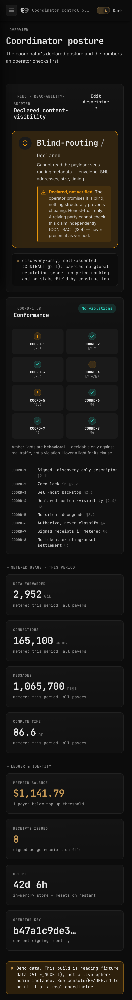

<p align="center">
  
</p>

<h1 align="center">Ephor</h1>

<p align="center">
  <b>The broker (coordinator) reference implementation of the KOTVA standard — content-blind
  by construction, swappable, no token.</b>
</p>

<p align="center">
  <a href="LICENSE-MIT"></a>
  <a href="Cargo.toml"></a>
  
  <a href="https://github.com/vul-os/kotva"></a>
  
</p>

<p align="center">
  
  
</p>

*ephor — Greek for overseer: in Sparta, one of five magistrates elected annually to
check the kings' power, never sovereign and never reappointed — the same shape here, a
swappable service point that watches traffic pass without ever seeing inside it, hired
for a term and replaced without ceremony.*

---

## What is Ephor

Ephor is the **single project that implements
[`coordinator/CONTRACT.md`](https://github.com/vul-os/kotva/blob/main/coordinator/CONTRACT.md)**
— the KOTVA spec's contract for centralization that is *hired, not depended-on*. A
**coordinator** is any party providing a function the peer-to-peer substrate can't provide
reciprocally: a global view, a scarce resource, a legal anchor. Ephor houses **every
coordinator kind** behind that one contract (see [The coordinator kinds](#the-coordinator-kinds)
below).

Every kind is:

- **Accountable** — an attested identity plus a signed descriptor, not an anonymous relay.
- **Swappable** — leaving is a config change: zero migration, zero identity change.
- **Self-hostable**, with one disclosed exception class — scarce network reachability
  (port-25 egress for `gateway`, public ingress for `reachability-adapter`).
- **Declared content-visible** at exactly one class × level, never silently downgraded.

**Content-visibility is a checkable type, not a policy promise.** `broker-economics` models it
as `VisibilityClass` (`blind` / `blind-routing` / `terminating`) × `AssuranceLevel` (`structural`
/ `attested` / `declared`) — CONTRACT §3 — and `broker-conformance`'s **COORD-1..8** harness
checks a coordinator's implementation against its own declaration rather than trusting prose.
Some clauses are decidable from the descriptor alone; COORD-5 (observed-vs-declared visibility)
is behavioral and can only be caught against real traffic, so the harness marks it
`Outcome::Behavioral` instead of falsely passing it — per-kind runtime tests then discharge it
where a real implementation exists (`gateway`, `reachability-adapter` today).

A coordinator **authorizes from identity and rate; it never classifies content** on a delivery
or canonical path — that judgement belongs to the recipient. **No token.** Economics are a
signed tariff plus signed usage receipts delivered to the payer (a one-directional audit — proves
a claimed operation happened, can't disconfirm a fabricated one, see
[Billing & pricing](#billing--pricing)). Settlement rides an existing stablecoin or fiat rail;
Ephor brokers none and takes no cut. Stake (where a kind requires skin-in-the-game — `arbiter`,
`oracle`) is verified on the settlement rail itself, never merely asserted.

> **Not** the OS app-gateway. Routing `/app/<id>` to a box's local app ports (with auth-token
> injection) is the VulOS shell's own internal reverse proxy — a separate concern that stays in
> the OS. Ephor crosses the *network* boundary (P2P, public exposure, mail egress), not the
> in-box one.

## The coordinator kinds

| Kind | Provides | Declared visibility | Status |
|---|---|---|---|
| `gateway` | Legacy mail bridge — MX, DKIM, SMTP/IMAP/POP3 | `terminating` — the one non-blind kind, disclosed | **built**, 320 tests |
| `relay` | Mesh reachability for NAT'd peers, real libp2p 0.56 Circuit Relay v2 | `blind` / `structural` | **built**, 12 tests, real two-peer loopback relay proof |
| `reachability-adapter` | ngrok-style public subdomains for box services, SNI-passthrough | `blind-routing` / `structural`(own-domain) or `declared`(vanity) | **built**, 32 tests — REACH-2 key-auth done, control channel not yet Noise-encrypted (see [Honest limits](#honest-limits)) |
| `media-relay` | Scales calls — orchestrates an external SFU (coturn/LiveKit), SFrame-sealed payload (RFC 9605) | `blind-routing` / `structural` | **built**, 24 tests |
| `indexer` | Search/discovery over an opt-in public corpus | `terminating` / `declared` (attested-TEE option) — `Gate::DerivedViewOnly` (§4 carve-out) | **scaffold**, 8 tests |
| `labeler` | Opt-in, subscribable moderation labels — §4's own named carve-out example | `terminating` / `declared` — `Gate::DerivedViewOnly` | **scaffold**, 7 tests |
| `matcher` | Real-time supply/demand matching (rides, delivery) | `terminating` / `declared` (attested-TEE option) — `Gate::DerivedViewOnly` | **scaffold**, 8 tests |
| `arbiter` | Dispute resolution over disclosed evidence, staked jury | `terminating` / `declared` — `Gate::NoDeliveryPath` | **scaffold**, 7 tests |
| `oracle` | Physical-world/real-fact attestation (`ORACLE ⊂ ATTEST`, DIRECTION §2) | `terminating` / `declared` — `Gate::NoDeliveryPath` | **scaffold**, 7 tests |
| `compute` | Outsourced computation, provisional per CONTRACT §5's own table | `terminating` / `declared` (attested-TEE "blind compute" option) — `Gate::NoDeliveryPath` | **scaffold**, 8 tests |

"scaffold" means a real `broker_conformance::Coordinator` implementation and a real
`kotva-core`-signed descriptor exist and are tested, but the kind's own function (ranking,
labeling, matching, arbitration, attestation, compute) is future work, disclosed in each crate's
docs — not silently stubbed. `indexer` / `labeler` / `matcher` never present their opt-in ranking
as an authoritative delivery path; `arbiter` / `oracle` / `compute` are neither a delivery path
nor a §4 derived view, so they declare `Gate::NoDeliveryPath` instead.

## The operator console

<p align="center">
  
  
</p>

The **Ephor operator console** (`console/`) is the web UI an operator runs a coordinator with:
one Svelte 5 app fronting the [`admin`](crates/admin) crate's HTTP API — the coordinator-kind-
agnostic control plane for a descriptor, a tariff, metering/receipts, quota, and the operator's
signing keys. Six views behind one left-nav shell:

| # | View | What it's for |
|---|---|---|
| 01 | Overview | Kind + declared content-visibility badge, live COORD-1..8 strip, headline metrics (metered usage, prepaid balance, receipts issued, uptime) — the coordinator posture pictured above |
| 02 | Descriptor | View/edit operator policy + declared visibility, sign & publish; warns before a silent visibility downgrade (CONTRACT §3.2) and requires explicit disclosure to proceed |
| 03 | Pricing | Recommended cost-plus USD pricing (Hetzner/Vultr basis) as a reference only, plus your own editable, signable `TariffSchedule` — no token field anywhere in this UI (DIRECTION §5) |
| 04 | Billing | Prepaid credit balance per payer, top-up, metered usage, and signed receipts with the one-directional-audit caveat surfaced on every panel — see [Billing & pricing](#billing--pricing) |
| 05 | Keys | Current signing pubkey + rotate (re-signs the descriptor; old keys kept in history, never dropped) |
| 06 | Conformance | The full COORD-1..8 checklist — pass / behavioral / violation, with clause refs |

Run it locally in mock mode (no `ephor-admin` needed — full in-memory fixture data):

```sh
cd console && pnpm install && pnpm dev   # http://localhost:5173, VITE_MOCK=1 by default
```

To point it at a live coordinator instead, build with `VITE_MOCK=0` and `VITE_API_BASE` set to
your `ephor-admin` bind address (loopback by default, bearer-token gated, fail-closed if no
token is configured). See [`console/README.md`](console/README.md) for the full DTO-to-Rust
mapping and the screenshot pipeline (`pnpm build && pnpm screenshot`).

## Billing & pricing

**Prepaid top-up credit metered against usage is the primary model.** An operator's payer tops
up a credit balance (via a settlement rail, see below); `broker-billing::prepaid::PrepaidLedger`
debits it against real metered usage and issues a signed receipt per debit
(`BillingState::{Ok, LowBalance, Exhausted}`). This preserves zero-lock-in (CONTRACT §2.2), fits
the anonymous-but-accountable posture SEC-7 allows, matches §6's continuous-metering model better
than an after-the-fact tab, and mirrors patala's own prepaid `PostageProvider` seam. **Ephor
holds no funds** — a credit is a claim backed by an on-rail funding reference, never custody.

A thin, **optional** monthly-card postpaid add-on (`broker_billing::subscription::Subscription`)
rides the exact same `SettlementRail` seam for operators who want a card-on-file experience
instead — secondary by design, not the default.

<p align="center">
  
  
</p>

The console is responsive: on a phone the sidebar collapses to a drawer and the
metric grid drops to a single column so no figure is truncated.

<p align="center">
  
</p>

### Recommended pricing (cost-plus, illustrative)

`broker-billing::pricing::recommended_tariff` turns a real infra cost profile into a **starting
point**, never a mandate — CONTRACT §6 is explicit that quotas, rates, and prices are operator
policy. The formula amortizes a `HostingProfile`'s fixed VPS cost (plus, for the two
scarce-reachability kinds, a reachability premium) into a per-unit cost, then applies a 2.00x
cost-plus markup:

| Kind | Priced unit | Hetzner-like profile (~$5/mo, ~$0.01/GiB) | Scarce-reachability premium applied? |
|---|---|---|---|
| `relay` / `media-relay` | per GiB forwarded | recommended | no |
| `reachability-adapter` | per GiB forwarded | recommended, **higher than `relay`** for the same profile | yes (+$5/mo) |
| `gateway` | per 1,000 messages | recommended | yes (+$5/mo) |
| `compute` | per 1,000 compute-seconds | recommended | no |

The exact cents come out of `recommended_tariff` against a chosen `HostingProfile`
(`HETZNER_CX`, `VULTR_GENERIC`, or a padded `GENERIC_VPS`) — see
[`crates/broker-billing/src/pricing.rs`](crates/broker-billing/src/pricing.rs) for the full
formula, the batching rationale (bandwidth/messages/compute-seconds are priced per-batch so
integer cents stay non-zero), and the sourcing caveat on the illustrative profile constants. USD
is the **pricing/display** currency only; settlement itself is stablecoin or fiat via the rail —
every number here is operator-overridable before it's ever signed.

### Signed usage receipts — and the one-directional-audit caveat

Every billed operation gets a signed `UsageReceipt` (`broker-billing::ReceiptLog`) the payer can
verify. Read `.verify()` honestly: it proves the coordinator **signed a claim**, never that the
claim is **true**, and never that no unreceipted charge happened elsewhere. This is demonstrated
by a test — a receipt for a fabricated, never-metered operation verifies identically to a receipt
for a real one. It's a real accountability primitive, not a fraud-proof one; treat it as such.

### Settlement rails — no token

`broker-billing::SettlementRail` is a provider-agnostic seam with one in-tree mock reference
adapter (`InMemoryLedger`, an explicit double-entry mock, no external custody). The optional
**[`broker-billing-patala`](crates/broker-billing-patala)** crate adapts it onto real
[`patala`](https://github.com/vul-os/patala) rails — `patala-stellar` shipped as the one
reference crypto top-up rail (Ed25519-native, so a coordinator's own substrate identity key can
double as the receiving wallet), `patala-hyperswitch` noted (not depended on) for the optional
card/monthly path. It is a real workspace member but kept **out of `default-members`** — a plain
`cargo build`/`cargo test` at the repo root never compiles a patala crate; only
`cargo build -p broker-billing-patala` (or an explicit `--workspace`) pulls it in. There is **no
protocol token anywhere** (DIRECTION §5) — `Descriptor` structurally cannot carry a stake field
or a price rank (CONTRACT §2.1); stake, where a kind requires it, is verified on the settlement
rail itself.

## The Rust workspace

All-Rust, one crate per coordinator kind plus shared model/harness/billing/admin crates.
Substrate types (MOTE, envelope, identity/naming, PUB, SYNC, signing/DS-tags, CBOR, crypto) come
from **`kotva-core`** / **`kotva-mail`** — crates carved out of envoir, living in the kotva repo,
and **pinned by tag** (`core-v0.2.0`), **never tracked at HEAD** (the *isango* guardrail:
extracting this same gateway from envoir failed twice before against a moving core).

| Crate | Role | Status |
|---|---|---|
| [`broker-economics`](crates/broker-economics) | Content-visibility model, coordinator-kinds table, signed descriptor/tariff/usage-receipt shapes | built |
| [`broker-conformance`](crates/broker-conformance) | The `Coordinator` trait + COORD-1..8 checklist harness | built |
| [`broker-billing`](crates/broker-billing) | Metering, `TariffSchedule`, prepaid ledger, signed receipts, `SettlementRail`/`StakeVerifier` seams, USD recommended pricing | built |
| [`broker-billing-patala`](crates/broker-billing-patala) | **Optional**, non-default: `SettlementRail` over real `patala` rails | built, isolated |
| [`admin`](crates/admin) | Kind-agnostic operator HTTP API (`ephor-admin` binary) | built |
| [`gateway`](crates/gateway), [`relay`](crates/relay), [`reachability-adapter`](crates/reachability-adapter), [`media-relay`](crates/media-relay) | The four built coordinator kinds | built |
| [`indexer`](crates/indexer), [`labeler`](crates/labeler), [`matcher`](crates/matcher), [`arbiter`](crates/arbiter), [`oracle`](crates/oracle), [`compute`](crates/compute) | The six scaffolded kinds | scaffold |

Full crate map, per-crate detail, and the `kotva-core` pin mechanics:
[crates/README.md](crates/README.md).

```sh
cargo build --workspace
cargo test  --workspace     # 548 tests, clippy clean
cargo clippy --workspace --all-targets
```

The Go tree (`go build ./...`) and the Rust workspace coexist at the repo root (`Cargo.toml` +
`go.mod`) — building one does not affect the other; see
[Preserved Go implementation](#preserved-go-implementation-relay-kind) below.

## Honest limits

Disclosed residuals, not silently fixed:

- **`reachability-adapter` REACH-2**: the box↔adapter control channel is key-authenticated
  (challenge-response against the box's identity, replay-inert) but **not yet Noise-encrypted** —
  an on-path attacker can observe/DoS the control channel but not impersonate a box. Transport
  confidentiality/integrity is still open; do not expose it publicly until that lands.
- **`broker-billing` receipts are a one-directional audit** (CONTRACT §6, R-6):
  `UsageReceipt::verify()` proves the coordinator signed a claim, never that the claim is true or
  that no unreceipted charge exists elsewhere.
- **Settlement and stake are seams, not rails**: `SettlementRail`/`StakeVerifier` each ship with
  one mock reference adapter (`InMemoryLedger`; fail-closed `NoStakeRail`). The real
  `broker-billing-patala` adapter is untested against a live Stellar network — disclosed in-crate,
  not merely absent.
- **`indexer` / `labeler` / `matcher` / `arbiter` / `oracle` / `compute` are scaffolds** — a real
  signed descriptor and conformance posture exist; the kind's own function does not yet.
- **The Go reverse-tunnel relay + the `@vulos/relay-client` JS SDK remain the working
  implementation** until the Rust `relay` port is proven in production and this note is removed
  — see [Status](#status-honest-as-of-this-writing) and
  [Preserved Go implementation](#preserved-go-implementation-relay-kind) below.
- **The wire layout chosen for `Descriptor`/`Tariff`/`UsageReceipt`** (canonical §18.1.1 CBOR,
  Ed25519, DS-tagged) is logged to `COORDINATION.md` for the spec session but not yet ratified
  into `coordinator/CONTRACT.md` itself — treat it as this implementation's proposal, not yet
  normative.
- **`media-relay` orchestrates an external SFU**, it does not embed one — bind-don't-reinvent, by
  design; large-scale SFU capacity is out of scope for this crate.

---

## Status (honest, as of this writing)

Ephor is **mid-rewrite**. Read this before relying on any of it in production.

- **The Rust workspace is in progress, not the shipping implementation yet.** The
  **Go reverse-tunnel relay** (`tunnel/`, `cmd/`) and the **`@vulos/relay-client` JS
  SDK** (`client/`) are the **preserved, working implementation** — keep using them
  until the Rust port is proven and this note is removed. See
  [Preserved Go implementation](#preserved-go-implementation-relay-kind) below.
- **`reachability-adapter`: not public-safe yet.** REACH-2 key-auth is wired, but the control
  channel is still plain (unencrypted) TCP — see [Honest limits](#honest-limits).
- Live, wave-by-wave status lives in [BUILD-PLAN.md](BUILD-PLAN.md); decisions are
  logged append-only in [DECISIONS.md](DECISIONS.md).

---

## Preserved Go implementation (`relay` kind)

Until the Rust `relay` crate is proven in production, this repo's **working relay** is the
original Go reverse-tunnel + the JS peer-fabric SDK. Both are frozen-but-maintained, not
deprecated — see [Status](#status-honest-as-of-this-writing).

### `@vulos/relay-client` (JS/TS SDK)

Wires browser peers together with **WebRTC peer-to-peer data channels**, falling back
to a relay circuit when a direct connection can't be established. It's a **client
only** — it talks to its host app's `/api/peering/*` endpoints for signaling and ICE
credentials, and only ever speaks `https`/`wss`.

```bash
npm install @vulos/relay-client
```

```js
import { selectEndpoint }  from '@vulos/relay-client/endpoints'
import { FabricClient }    from '@vulos/relay-client/fabric'
import { PresenceManager } from '@vulos/relay-client/presence'

const base = await selectEndpoint()               // LAN-direct → cloud → same-origin

const fabric = new FabricClient({
  sessionId:    'doc-abc123',
  peerId:       currentUser.id,
  signalingUrl: `${base.replace(/^http/, 'ws')}/api/peering/stream`,
  iceUrl:       `${base}/api/peering/ice`,
  authToken:    session.jwt,                       // optional Bearer JWT
})

fabric.addEventListener('message', ({ detail: { from, data } }) => console.log(from, data))
await fabric.join()
fabric.send(JSON.stringify({ op: 'insert', pos: 0, text: 'hello' }))

const presence = new PresenceManager({ fabric, localIdentity: { accountId: currentUser.id } })
presence.join()
```

Key properties: **E2E peer authentication** (per-session ECDSA P-256, every
offer/answer/ICE frame and relay deposit signed, TOFU + replay cache),
**endpoint failover** (LAN ↔ cloud, 400 ms debounce), **presence + live cursors**
(React hooks), **P2P mesh calls** (`createCall`; the LiveKit SFU path was removed
before 1.0). Full option list: [docs/CONFIGURATION.md](docs/CONFIGURATION.md); design:
[docs/ARCHITECTURE.md](docs/ARCHITECTURE.md); subpath map:
[client/README.md](client/README.md).

### Sovereign reverse tunnel (Go)

A self-hosted **replacement for `frp` / ngrok / Cloudflare Tunnel**: a loopback-bound
box dials one outbound `wss://` connection to a relay **you control**, which serves a
public URL and reverse-proxies HTTP + WebSocket back down it — no inbound ports, no
static IP, no third-party relay.

```bash
./scripts/install.sh --domain relay.example.com   # one command, needs Docker Compose
```

or run the binaries directly:

```bash
go run ./cmd/vulos-relayd -domain relay.example.com -tokens-file grants.json
go run ./cmd/vulos-relay-agent -server wss://relay.example.com -token SECRET1 -name box1 -local 127.0.0.1:8080
```

```sh
go build ./...
go test -race ./...
go vet ./...
```

**Security posture — honest, no overclaim.** The relay is a **content-visible Layer-7
terminating proxy**, not an end-to-end-encrypted pipe: it (or its fronting edge)
terminates the client's TLS, so the **relay operator can read and modify all tunneled
HTTP**. Confidentiality rests on **who runs the relay**: self-host it (you are the
operator), or use a **verified direct endpoint** (TLS runs client↔box, bypassing the
relay). This is exactly the honesty gap the Rust `reachability-adapter`'s
SNI-passthrough transport is built to close for NAT'd boxes — see
[Honest limits](#honest-limits) for why it isn't public-safe yet either.

Other hardening already in the Go relay: bearer-token agent auth (constant-time,
hashed at rest), token-bound names, an SSRF guard on the agent's forward target,
per-IP/per-tunnel/global rate limiting (`429`), over-quota cut (`402`), token
revocation (file/env list + runtime API + periodic sweep), a verified **direct-IP
fast path** (near-native latency, unmetered, bypasses the relay entirely), request
bounds (256 MiB body cap, slow-body ingestion deadline), a loopback/token-gated admin
listener for `/metrics` + `/healthz` + `/readyz` (never on the public tunnel), and a
geo-distributed pool with a CP-driven, make-before-break autoscaler (fully
CP-optional — a self-host relay runs none of it). Real-time media (RTP) never rides
the tunnel — it goes over ICE/TURN directly, preferring the box's verified direct
endpoint. Full trust model and deploy notes:
[docs/SECURITY.md](docs/SECURITY.md) · [docs/TUNNEL.md](docs/TUNNEL.md) ·
[docs/GETTING-STARTED.md](docs/GETTING-STARTED.md).

The relay also serves two **open, opt-in roles** any conforming operator can run: a
**rendezvous** role (signed, content-blind announce/resolve/signal/mailbox + ICE
substrate for OS-free P2P signaling — [docs/RENDEZVOUS.md](docs/RENDEZVOUS.md)), and a
**pubcache/pin** role (a verifying read-through cache + durable pin store for public,
self-verifying DMTAP-PUB objects, refusing anything that doesn't match its content
address — [docs/PUBCACHE.md](docs/PUBCACHE.md), [docs/PINNING.md](docs/PINNING.md)).
Pubcache is the one role that is **not** content-blind (it serves public plaintext by
design) and is off by default, explicit opt-in.

---

## Documentation

| Document | Description |
|----------|-------------|
| [HANDOVER.md](HANDOVER.md) | The build brief: target architecture, guardrails, build order |
| [BUILD-PLAN.md](BUILD-PLAN.md) | Live wave-by-wave status of the Rust port |
| [DECISIONS.md](DECISIONS.md) | Append-only decision log |
| [COORDINATION.md](COORDINATION.md) | Cross-repo sync log with the kotva spec session |
| [crates/README.md](crates/README.md) | Rust workspace map, per-crate status, the `kotva-core` seam |
| [console/README.md](console/README.md) | Operator console views, stack, mock mode, screenshot pipeline |
| [brand/README.md](brand/README.md) | The Bronze comma mark — concept, palette, file map, usage rules |
| [docs/GETTING-STARTED.md](docs/GETTING-STARTED.md) | Zero-to-reachable-box walkthrough (Go relay) |
| [docs/SECURITY.md](docs/SECURITY.md) | Go relay trust model — what the operator can/cannot see |
| [docs/TUNNEL.md](docs/TUNNEL.md) | Full server flag/env reference & deploy notes (Go relay) |
| [docs/TUNNEL-GUIDE.md](docs/TUNNEL-GUIDE.md) | Protocol/lifecycle deep dive — wss+yamux, reconnects |
| [docs/METERING-BILLING.md](docs/METERING-BILLING.md) | How Go-relay transfer is metered (opt-in; unbilled self-host by default) |
| [docs/RENDEZVOUS.md](docs/RENDEZVOUS.md) | The open rendezvous role — wire protocol, auth, signing |
| [docs/PUBCACHE.md](docs/PUBCACHE.md) | The open cache/pin role — verification gate, bounds |
| [docs/PINNING.md](docs/PINNING.md) | Durable pin store — budget, refusal semantics, signed wire protocol |
| [docs/ARCHITECTURE.md](docs/ARCHITECTURE.md) | JS SDK fabric / signaling / endpoint-failover design |
| [docs/CONFIGURATION.md](docs/CONFIGURATION.md) | All JS SDK options and constructor params |
| [docs/TROUBLESHOOTING.md](docs/TROUBLESHOOTING.md) | Symptom → cause → fix field guide (Go relay) |
| [client/README.md](client/README.md) | JS SDK subpath exports + migration notes |
| [ROADMAP.md](ROADMAP.md) | Planned directions for the JS SDK |
| [CHANGELOG.md](CHANGELOG.md) | Release history |

The KOTVA spec itself (`coordinator/CONTRACT.md`, `DIRECTION.md`, and the per-kind
`profiles/`) lives in the [kotva repo](https://github.com/vul-os/kotva) and is owned by
that project, not duplicated here.

---

## Development

```sh
# Rust workspace
cargo build --workspace && cargo test --workspace

# Go relay (server + agent)
go build ./... && go test -race ./...

# JS SDK
cd client && npm ci && npm run build && npm test

# Operator console
cd console && pnpm install && pnpm build && pnpm check
```

CI ([`.github/workflows/ci.yml`](.github/workflows/ci.yml)) builds and tests the JS
client on Node 20 and runs a Trivy filesystem scan (HIGH/CRITICAL gating). The
publishable JS package lives in `client/`; the repository root holds dev tooling
(screenshot capture, etc.) under `scripts/`.

### Release (JS SDK)

```bash
# bump version in client/package.json first, then:
git tag v1.2.3 && git push origin v1.2.3
```

The [release workflow](.github/workflows/release.yml) builds, tests, verifies the tag
matches `client/package.json`, and publishes to npm with OIDC provenance.

---

## Security

**Vulnerability disclosure.** Report via GitHub Security Advisories (preferred) or
`security@vulos.org`. In-scope areas include the Go relay's endpoint probe/cache
integrity, signaling session isolation, peer-auth bypass, and offline-queue integrity,
as well as the Rust workspace's coordinator conformance, content-visibility
enforcement, and billing/receipt integrity. Acknowledgement within 72 hours. Full
policy: [SECURITY.md](SECURITY.md).

**JS SDK peer authentication.** Every `FabricClient` session generates an ephemeral
ECDSA P-256 key pair; the public key is published in the signaling `join` frame and
every outgoing `offer`/`answer`/`ice` frame and relay deposit is signed over its
canonical form. By default (`requirePeerAuth: true`) unsigned frames from unknown
peers are rejected (TOFU on first signed frame); replayed `(from, nonce)` pairs are
dropped (bounded FIFO cache). Details: [docs/ARCHITECTURE.md](docs/ARCHITECTURE.md).

---

## Contributing

See [CONTRIBUTING.md](CONTRIBUTING.md) for dev-environment setup, branch and commit
conventions, and scope constraints.

---

## License

[MIT](LICENSE-MIT) OR [Apache-2.0](LICENSE-APACHE) — © VulOS. Ephor is a VulOS
project; source and issues at
[github.com/vul-os/ephor](https://github.com/vul-os/ephor). Brand mark, palette, and
usage rules: [brand/README.md](brand/README.md).

---

<p align="center">
  <a href="https://vulos.org"></a><br>
  <sub><a href="https://vulos.org"><b>vulos</b></a> — rooted in <b>vula</b>, the Zulu/Xhosa word for
  <b>open</b></sub>
</p>
