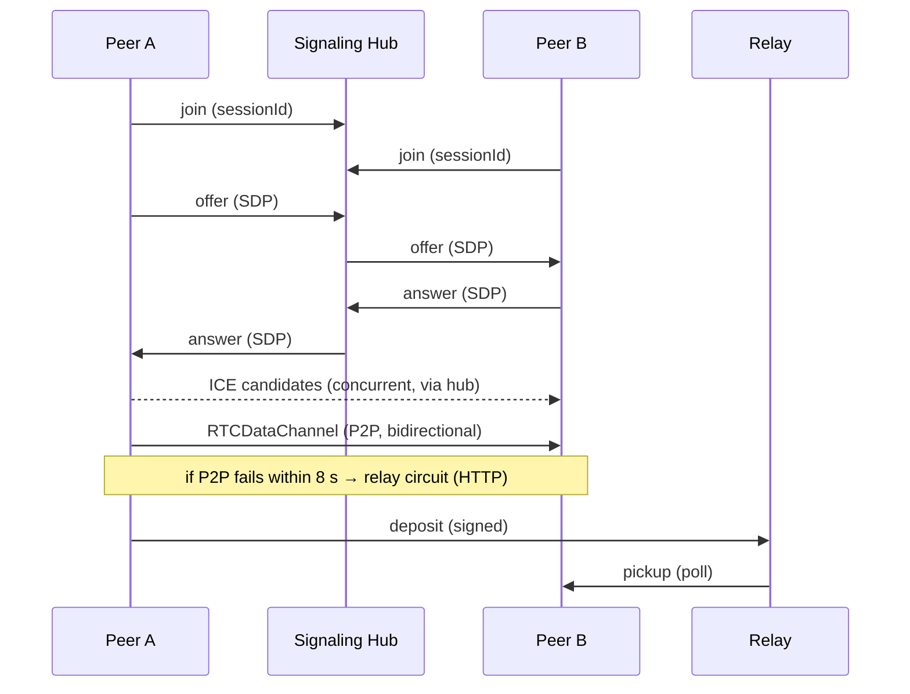

<div align="center">


# Vulos Relay

**`@vulos/relay-client` — the sovereign peer-fabric client SDK for VulOS web surfaces**

[](https://www.npmjs.com/package/@vulos/relay-client)
[](LICENSE)
[](https://github.com/vul-os/vulos-relay/actions/workflows/ci.yml)

<sub> Part of <strong><a href="https://vulos.org">VulOS</a></strong> — the open, self-hostable web OS &amp; app suite. Runs standalone, or combined under one login by <a href="https://vulos.org">Vulos Workspace</a>.</sub>

*Vulos — rooted in **vula**, the Zulu and Xhosa word for **open**.*

</div>

---

## What is Vulos Relay?

Vulos Relay is the **sovereign connectivity fabric** for the VulOS suite. Its
single deliverable is `@vulos/relay-client` — a browser-side JS SDK that wires
peers together: it opens **WebRTC peer-to-peer data channels** between
collaborators, multiplexes signaling, presence, and live cursors over them, and
**falls back to a relay circuit** whenever a direct connection can't be
established.

It is a **client only** — no server ships in this package. The SDK talks to its
host application's `/api/peering/*` endpoints over HTTP and WebSocket for
signaling and ICE credentials. When P2P fails, deposits and pickups flow through
the host's relay circuit (the deposit/pickup HTTP API). TLS is always terminated
at the edge — a cloud POP for cloud-routed installs, or the box itself for
LAN-direct — so the SDK only ever speaks `https`/`wss` to whichever endpoint it
has selected.

---

## Part of VulOS

**VulOS** is an open, self-hostable web OS + app suite. Each product is
self-hostable on its own, and combined under one login by **Vulos Workspace**:

| Product | What it is |
|---------|------------|
| **Vulos Mail** | Mail + calendar + contacts |
| **Vulos Talk** | Team chat + channels/Spaces + huddles |
| **Vulos Meet** | Video meetings (LiveKit SFU) |
| **Vulos Office** | Documents: docs, sheets, slides, PDF |
| **Vulos Relay** | **← this repo** — sovereign connectivity fabric (`@vulos/relay-client`) |
| **Vulos Workspace** | The open suite shell (one login, app switcher, admin) |
| **Vulos OS** | The web-native desktop |

**Relay's role:** it is the connectivity fabric the rest of the suite is built
on. The SDK is consumed directly by the VulOS web surfaces — the
[Vulos OS shell](https://github.com/vul-os/vulos),
[Vulos Office](https://github.com/vul-os/vulos-office), and
[Vulos Talk](https://github.com/vul-os/vulos-talk) — to power real-time
collaboration. [Vulos Workspace](https://github.com/vul-os/vulos-workspace)
surfaces Relay as a first-class app in its launcher; it links to and embeds
products but never imports their code, so the seams stay clean.

Relay runs standalone **and** is combined by Vulos Workspace. The client is a
plain npm package with no Vulos-specific runtime dependency — point it at any
backend that implements the peering contract and it works on its own.

---

## Features

- **P2P fabric sessions** — `FabricClient` opens one `RTCDataChannel`
  (DTLS-SRTP) per remote peer for a given session/document id, with
  polite-peer SDP negotiation (the lexicographically smaller `peerId` defers).
- **Relay fallback** — when a data channel can't be established within 8 s (or a
  live connection fails), the SDK transparently switches that peer to a **relay
  circuit**: messages are deposited and picked up over the host's
  `deposit` / `pickup` / `ack` HTTP API.
- **Signed deposits** — each peer mints a per-session **ECDSA P-256** key on
  join, publishes the raw public key in its signaling join frame (bound
  server-side to the authenticated `peerId`), and signs every relay deposit
  (`to` + `from` + `nonce` + `blob`) so a correctly configured relay can reject
  forged payloads.
- **Endpoint failover** — `selectEndpoint()` health-probes a cloud and a LAN
  base URL concurrently, prefers LAN-direct for latency, falls back to cloud,
  then same-origin. A 400 ms debounce coalesces Wi-Fi-handoff bursts; failures
  force an immediate re-probe; selections are cached in `localStorage` so
  failover keeps working with the discovery cloud down.
- **Signaling reconnect** — `SignalingClient` rides the host's
  `/api/peering/stream` WebSocket with exponential back-off (1 s → 30 s) and a
  terminal `offline` event after a 10-attempt budget so the UI can show a
  degraded-mode banner. It keeps retrying at max delay, so it self-heals when
  the network returns.
- **Presence** — `PresenceManager` (+ `usePresence` React hook) broadcasts
  multi-peer awareness on a dedicated channel: 10 s heartbeat, 25 s GC, status
  values (`online` / `away` / `dnd` / `in-a-call`), and auto-generated,
  persisted guest identities.
- **Live cursors** — `useLiveCursors` React hook multiplexes carets and
  selections (Docs / Sheets / Slides) on the fabric channel with 80 ms
  pointer-event throttling and token-aware peer colours.
- **P2P mesh calls** — `createCall` for audio/video mesh sessions (the LiveKit
  SFU path was removed before 1.0; the product uses the P2P mesh exclusively).
- **Tree-shakeable subpaths** — import only what you need
  (`@vulos/relay-client/endpoints`, `/fabric`, `/presence`, …); the `xlsx`-using
  `roundTripCheck` is deliberately kept out of the root barrel.
- **Dual build** — ESM (`.js`) + CJS (`.cjs`) bundles with generated `.d.ts`
  types; `react` and `xlsx` are optional peer dependencies.

---

## Demo

Relay is a headless SDK, so there is **no app UI to screenshot**. Instead, the
repo ships a self-contained **interactive demo** (`demo/index.html`) that drives
the real SDK in the browser with in-process stub peers — no backend or
credentials required. The screenshotter renders it to PNGs:

| | |
|---|---|
|  |  |
| Endpoint failover + fabric/presence panels | Signaling & relay-fallback sequence |

Regenerate with `npm run screenshots` (Playwright). See
[docs/SCREENSHOTS.md](docs/SCREENSHOTS.md).

---

## Quick start (standalone)

`@vulos/relay-client` is a plain npm package — install it on its own, point it
at any backend that implements the peering contract, and use it without the rest
of VulOS.

```bash
npm install @vulos/relay-client
```

`react` and `xlsx` are **optional** peer dependencies — install them only if you
use the React hooks (`usePresence`, `useLiveCursors`) or the `roundTripCheck`
subpath.

A minimal fabric session with presence. All exports below are verified against
`client/src` — `FabricClient` and `PresenceManager` extend `EventTarget`, so you
subscribe with `addEventListener`.

```js
import { selectEndpoint }  from '@vulos/relay-client/endpoints'
import { FabricClient }    from '@vulos/relay-client/fabric'
import { PresenceManager } from '@vulos/relay-client/presence'

// 1. Pick the best reachable backend (LAN-direct → cloud → same-origin).
const base = await selectEndpoint()

// 2. Open a fabric session for a document/room id.
const fabric = new FabricClient({
  sessionId:    'doc-abc123',
  peerId:       currentUser.id,
  signalingUrl: `${base.replace(/^http/, 'ws')}/api/peering/stream`,
  iceUrl:       `${base}/api/peering/ice`,   // optional; this is the default path
  authToken:    session.jwt,                 // optional Bearer JWT
})

// 3. Receive application messages (e.g. CRDT ops) from peers.
fabric.addEventListener('message', ({ detail: { from, data } }) => {
  console.log('message from', from, data)
})

// 4. Track per-peer connection state: connecting | connected | relay | disconnected
fabric.addEventListener('state', ({ detail: { peerId, state } }) => {
  console.log(peerId, '→', state)
})

await fabric.join()
fabric.send(JSON.stringify({ op: 'insert', pos: 0, text: 'hello' })) // broadcast
// fabric.sendTo(peerId, payload)  // unicast to one peer

// 5. Layer presence on top of the fabric.
const presence = new PresenceManager({
  fabric,
  localIdentity: { accountId: currentUser.id, displayName: currentUser.name },
})
presence.addEventListener('roster', ({ detail: roster }) => console.log(roster))
presence.join()
```

In React, prefer the hooks:

```jsx
import { usePresence }    from '@vulos/relay-client/presence'
import { useLiveCursors } from '@vulos/relay-client/useLiveCursors'

const { roster, manager } = usePresence({ fabric, localIdentity })
const { remoteCursors, broadcastDocCursor } =
  useLiveCursors({ fabric, localIdentity, color })
```

Inside the VulOS monorepo, consumers use a `file:` dependency instead of the
published package:

```jsonc
// package.json
"@vulos/relay-client": "file:../vulos-relay/client"
```

To explore the SDK with **zero setup**, build the client and open the
interactive demo (it imports the built bundle directly — no backend needed):

```bash
cd client && npm ci && npm run build   # produces client/dist-lib/
npm run screenshots                    # or just open demo/index.html in a browser
```

> The endpoint layer also exposes `configure({ lsKeyPrefix, healthPath })` so a
> surface can preserve its existing `localStorage` cache and point the health
> probe at its own auth endpoint. See [`client/README.md`](client/README.md) for
> the full subpath map.

---

## Architecture

A fabric session moves through six phases:

1. **Join** — fetch ICE/TURN servers (`/api/peering/ice`, falling back to the
   cloud `/api/turn/credentials`) and open the signaling WebSocket.
2. **Signaling** — `SignalingClient` multiplexes `join` / `offer` / `answer` /
   `ice` / `leave` frames over the `signal` channel of the host's
   `/api/peering/stream` socket, addressed per session and per peer.
3. **SDP + ICE** — each peer pair negotiates an `RTCPeerConnection`
   (polite/impolite roles decided by `peerId` ordering) and exchanges ICE
   candidates.
4. **P2P data channel** — application traffic flows over a single
   `RTCDataChannel` (`vulos-office-fabric`) per peer.
5. **Relay fallback** — if a channel can't open within `RELAY_TIMEOUT_MS` (8 s),
   or fails later, that peer flips to `relay`: messages are signed and
   **deposited**, then **polled** back via the host's relay HTTP API.
6. **Presence + cursors** — `PresenceManager` and `useLiveCursors` ride
   dedicated `presence` and `cursors` channels on the same fabric, each with
   their own heartbeat / throttle.



**Transport stack.** This SDK is built on the browser's native primitives —
`RTCPeerConnection` / `RTCDataChannel` for P2P, `WebSocket` for signaling, and
`fetch` for ICE credentials and relay deposit/pickup. There is no proxy/tunnel
layer; the relay circuit is a plain authenticated HTTP store-and-forward served
by the host backend.

**TLS termination.** The SDK only ever talks to the base URL it selected, over
`https`/`wss`. TLS is terminated at the edge — a cloud POP for cloud-routed
installs, or the box itself for LAN-direct — never inside this client.

See [docs/ARCHITECTURE.md](docs/ARCHITECTURE.md) for the full layer-by-layer
design.

---

## Configuration

The SDK is configured through `FabricClient` / `PresenceManager` constructor
options and the `configure()` seam on the endpoint layer (localStorage key
prefix, health path). The full list of options — endpoint discovery sources,
constructor params, and tunables (timeouts, heartbeat, throttle) — is documented
in [docs/CONFIGURATION.md](docs/CONFIGURATION.md).

---

## Documentation

| Document | Description |
|----------|-------------|
| [docs/GETTING-STARTED.md](docs/GETTING-STARTED.md) | Install + first integration walkthrough |
| [docs/ARCHITECTURE.md](docs/ARCHITECTURE.md) | Fabric / signaling / endpoint-failover design |
| [docs/CONFIGURATION.md](docs/CONFIGURATION.md) | All SDK options and constructor params |
| [docs/SCREENSHOTS.md](docs/SCREENSHOTS.md) | Demo harness + screenshot regeneration |
| [client/README.md](client/README.md) | Subpath exports + migration notes |
| [ROADMAP.md](ROADMAP.md) | Planned directions |
| [CHANGELOG.md](CHANGELOG.md) | Release history |

---

## Development

The publishable package lives in `client/`. The repository root holds dev
tooling (e.g. screenshot capture) under `scripts/`.

```bash
cd client
npm ci
npm run build   # Vite lib build (ESM + CJS) + tsc .d.ts generation
npm test        # Vitest (jsdom)
```

Tests run under Vitest with jsdom; the SDK targets browser environments
(`WebSocket`, `RTCPeerConnection`, `BroadcastChannel`, `crypto.subtle`).

CI ([`.github/workflows/ci.yml`](.github/workflows/ci.yml)) builds and tests the
client on Node 20, then runs a Trivy filesystem scan (HIGH/CRITICAL gating).

### Release

Releases are cut by tagging. The
[release workflow](.github/workflows/release.yml) builds, tests, verifies the
tag matches `client/package.json`, and publishes to npm with OIDC provenance.

```bash
# bump version in client/package.json first, then:
git tag v1.2.3 && git push origin v1.2.3
```

---

## Security

Found a vulnerability? Please follow the disclosure process in
[SECURITY.md](SECURITY.md) — report via GitHub Security Advisories (preferred) or
`security@vulos.org`. In-scope areas include endpoint probe/cache integrity,
signaling session isolation, auth-token handling, and relay/offline-queue
integrity. Acknowledgement within 72 hours; confirmed reporters are credited in
release notes.

---

## Contributing

See [CONTRIBUTING.md](CONTRIBUTING.md) for dev-environment setup, branch and
commit conventions, and scope constraints.

---

## License

MIT — see [LICENSE](LICENSE).
