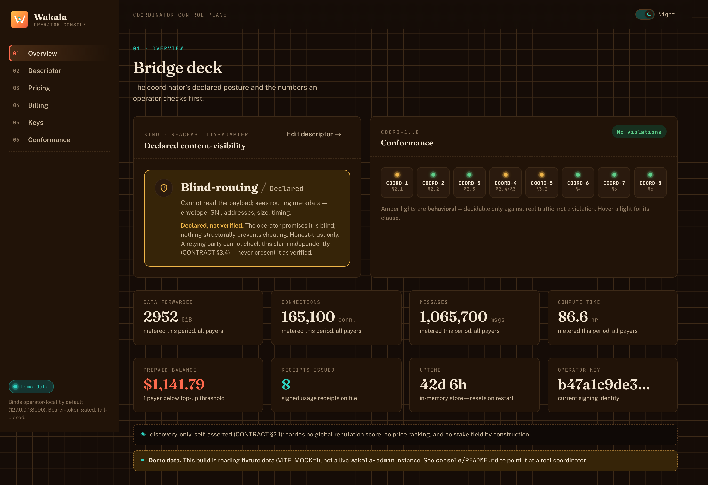

# Wakala Operator Console

The web UI an operator uses to run a Wakala coordinator: it fronts the `admin` crate's HTTP
API (`crates/admin`) — the coordinator-kind-agnostic control plane for a descriptor, a tariff,
metering/receipts, quota, and the operator's signing keys.

Six views, one left-nav shell:

| # | Route | What it's for |
|---|-------|----------------|
| 01 | Overview | Kind + declared content-visibility badge, live COORD-1..8 strip, headline metrics (metered usage, prepaid balance, receipts issued, uptime). |
| 02 | Descriptor | View/edit operator policy + declared visibility, sign & publish. Warns before a silent visibility downgrade (CONTRACT §3.2) and requires explicit disclosure to proceed. |
| 03 | Pricing | Recommended cost-plus USD pricing (Hetzner/Vultr basis) as a reference only, plus your own editable, signable `TariffSchedule`. No token field exists anywhere in this UI (DIRECTION §5). |
| 04 | Billing | Prepaid credit balance per payer, a Top-up action (patala rails — stablecoin or card), metered usage, and signed receipts — every receipts panel surfaces the one-directional-audit caveat (CONTRACT §6, R-6). An optional "monthly card" (postpaid via patala-hyperswitch) toggle sits clearly secondary to prepaid. |
| 05 | Keys | Current signing pubkey + rotate (re-signs the descriptor; old keys kept in history, never dropped). |
| 06 | Conformance | The full COORD-1..8 checklist — pass / behavioral / violation, with clause refs and what each behavioral item still needs a runtime test for. |



## Stack

Vite + Svelte 5 (runes) + TypeScript. No UI framework, no CSS framework, no router library —
a ~40-line hash router and hand-rolled components, on purpose: the surface is six views, not
sixty. Fonts are self-hosted via `@fontsource*` (Fraunces for display, JetBrains Mono for
identifiers/ledger numbers, Public Sans for body) so the console never depends on a font CDN.

**Design language — "Harbor Ledger":** an operator's control room styled as a shipping
manifest / bridge instrument panel, keyed off the real Wakala mark's amber→orange→teal
palette (`brand/logo-mark.svg`) rather than a generic dashboard template — brass CTAs, an ink
stamp on freshly signed artifacts, and COORD-1..8 rendered as running lights (green pass /
amber behavioral / red violation). Day watch (parchment, light) and night bridge (ink-brown,
dark) are both first-class; the theme toggle in the top bar overrides
`prefers-color-scheme`, which is the default.

## Develop

```sh
pnpm install
pnpm dev          # http://localhost:5173, mock data (VITE_MOCK=1, the default — see .env)
```

## Build

```sh
pnpm build        # -> dist/
pnpm preview       # serve dist/ locally
```

`pnpm check` runs `svelte-check` + `tsc` with no emit.

## Connecting to a real `wakala-admin`

By default (`.env`, committed — no secrets in it) this build runs entirely on the fixtures in
`src/lib/api.ts` (`VITE_MOCK=1`), so it works standalone for development and for the
screenshots below. To point it at a live coordinator instead:

1. Set `VITE_MOCK=0` and `VITE_API_BASE=http://127.0.0.1:8090` (or wherever `wakala-admin`
   binds — it defaults to loopback-only, see `crates/admin/src/config.rs`) at build time, or
   in a `.env.local`.
2. The admin API is bearer-token gated and fail-closed (`WAKALA_ADMIN_TOKEN` on the server
   side — no token configured means every request is `401`, not merely unauthenticated). This
   console reads the token from `localStorage['wakala:admin-token']` at runtime, or from
   `VITE_ADMIN_TOKEN` at build time as a fallback; it is never hardcoded or checked in.
3. The real admin API has no prepaid/patala surface of its own — CONTRACT §6 deliberately
   leaves settlement to an operator-supplied rail. `RealAdminClient` (`src/lib/api.ts`) calls
   a `/patala/accounts`, `/patala/topups/{payer}`, `/patala/monthly-card` convention on the
   same origin; stand up that small proxy in front of your patala integration, or swap in your
   own `AdminClient` implementation — it's one interface.

Every DTO in `src/lib/types.ts` and every call in `src/lib/api.ts`'s `RealAdminClient` is typed
1:1 against `crates/admin/src/{descriptor,tariff,billing,quota,keys,conformance}.rs` — if the
Rust DTOs change, this is the file to update.

## Mock mode

`src/lib/api.ts` exports `MockAdminClient`, a full in-memory implementation of the same
`AdminClient` interface `RealAdminClient` implements — the rest of the app never knows which
one it's talking to. It ships one realistic fixture posture: a `reachability-adapter`
declaring `blind-routing / declared` — the same "bare adapter-zone vanity" example
`broker-economics`' own tests use — specifically so the UI's "declared, not verified" duty
(CONTRACT §3.4) has something real to demonstrate, not just the trivial `terminating` case.
Signing, rotating, publishing a tariff, topping up, and running a billing period all mutate
that in-memory state for real (Descriptor's downgrade-disclosure gate included) — there's no
backend, but there's no lie about interactivity either.

## Screenshots

```sh
pnpm build
pnpm screenshot    # -> ../docs/img/console-{dark,light}.png, console-billing-{dark,light}.png
```

`scripts/screenshot.mjs` serves the built `dist/` on a scratch port, loads the console in mock
mode (the build's default), and captures the Overview and Billing views at a 1440×900 viewport
(2x device scale), full-page, once per color scheme via Playwright's `colorScheme` emulation —
so both images are exercising the real `prefers-color-scheme` CSS path, not a hardcoded theme.

`scripts/smoke.mjs` and `scripts/interact-smoke.mjs` are ad hoc dev checks (all six routes load
with no console errors; rotate/sign/publish/top-up/run-billing all complete) — not part of the
build or the screenshot flow.
