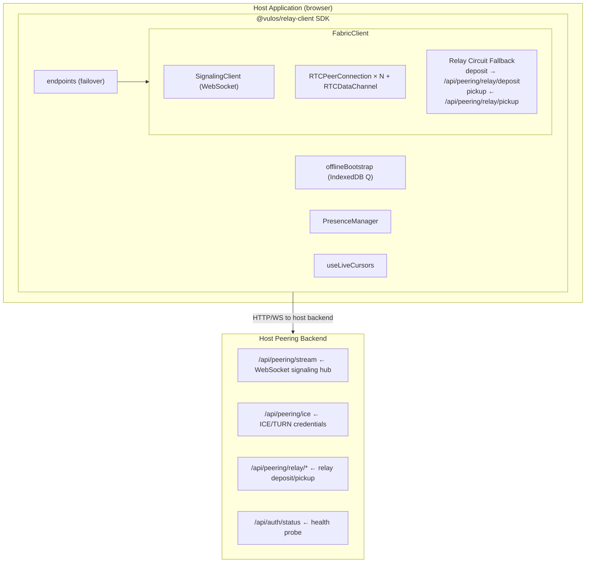
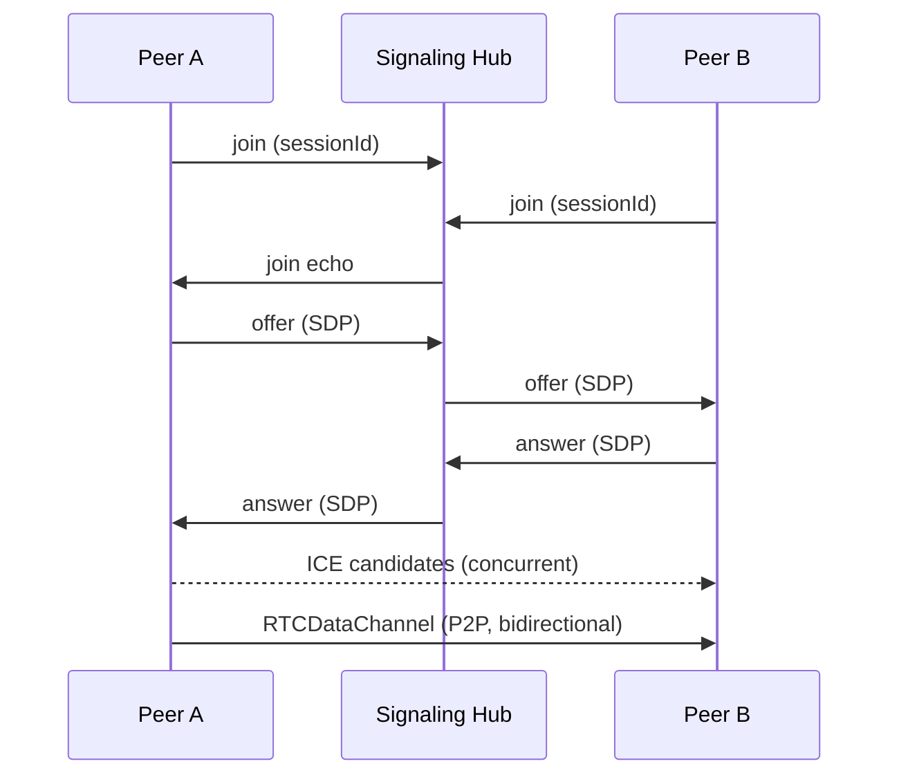

# Architecture — @vulos/relay-client

## Overview

`@vulos/relay-client` is a pure-browser JS SDK that handles all peer-fabric and
connectivity concerns for every Vulos web surface. It does **not** bundle a
server: it talks to the host application's own peering backend over HTTP and
WebSocket.

## Layers

### Endpoint failover (`/endpoints`)

Manages a pair of base URLs — one cloud-routed endpoint and one LAN-direct
endpoint — and selects the best reachable one.

**Discovery priority (frozen contract):**

1. `window.__VULOS_ENDPOINTS__` injected by the OS shell at serve time
2. Vite env vars: `VITE_CLOUD_ENDPOINT` / `VITE_LAN_ENDPOINT`
3. `localStorage` cache (survives a cloud-discovery outage)
4. Same-origin fallback (`''`)

**Selection priority:**

1. LAN-direct — lowest latency, works without internet
2. Cloud endpoint
3. Same-origin

Probes run concurrently (no added latency from a dead cloud route). A 400 ms
debounce coalesces Wi-Fi handoff storms. The selected endpoint is cached for
30 s; any API failure calls `invalidateEndpoint()` to force an immediate
re-probe.

### Offline bootstrap (`/offlineBootstrap`)

A single-call function that boots the shell in offline mode:

- Reads the last known state from IndexedDB
- Queues writes made offline and flushes them when connectivity resumes
- Accepts an optional `tierHint` callback for per-surface Pro-tier injection
  (keeps OS-specific logic out of the shared package)

### Signaling (`/signaling`)

`SignalingClient` connects to the host's `/api/peering/stream` WebSocket and
multiplexes offer/answer/ICE exchange frames over a `"signal"` channel.

**Reconnect budget:** exponential back-off from 1 s to 30 s, up to 10 attempts.
After the budget is exhausted a terminal `"offline"` event is emitted so UIs
can show a degraded-mode banner. The client continues retrying at the max delay
so the connection recovers automatically.

### Fabric sessions (`/fabric`)

`FabricClient` opens a per-document P2P mesh:

**Connection sequence:**

**Relay fallback:** if the data channel is not established within 8 s (e.g.
due to symmetric NAT), the fabric falls back to a relay circuit:

- Messages are `deposit`ed to `/api/peering/relay/deposit` (ECDSA P-256 signed)
- The remote peer polls `/api/peering/relay/pickup` every 2 s
- Once a P2P channel becomes available, relay polling stops

**Polite-peer rule:** the lexicographically smaller `peerId` is the offerer; the
larger is the answerer. This prevents glare (simultaneous offer) without
requiring server coordination.

### Presence (`/presence`)

`PresenceManager` multiplexes a `"presence"` channel on top of the fabric data
channel. It broadcasts `{accountId, displayName, color, status, statusText}` as
a heartbeat every 10 s and removes peers that go silent for 25 s.

Guest identities are auto-generated (`Swift Lemur`, `Calm Fox`, …) and persisted
in `localStorage` across sessions.

Status values: `online`, `away`, `dnd`, `in-a-call`.

### Live cursors (`/useLiveCursors`)

`useLiveCursors` is a React hook built on top of the fabric data channel. It
multiplexes a `"cursors"` channel and debounces pointer events to limit
bandwidth.

### Call (`/call`)

`createCall` sets up a P2P mesh WebRTC call (audio/video). The LiveKit SFU path
was removed before 1.0 — the product uses P2P mesh (≤ 5 peers) exclusively.

## Dual build

The SDK ships both ESM (`.js`) and CJS (`.cjs`) bundles from a Vite lib build.
`react` and `xlsx` are optional peer dependencies so consumers deduplicate them.

## Trust model

- Relay deposits are ECDSA P-256 signed with a per-session key generated in
  `SubtleCrypto`. The public key is published in the signaling join payload so
  the relay server can verify deposit integrity.
- Auth tokens (Bearer JWT) are passed as URL query params to the WebSocket and
  as `Authorization` headers to HTTP endpoints.
- The relay server MUST check that the `from` field in a deposit matches the
  authenticated peer identity.
